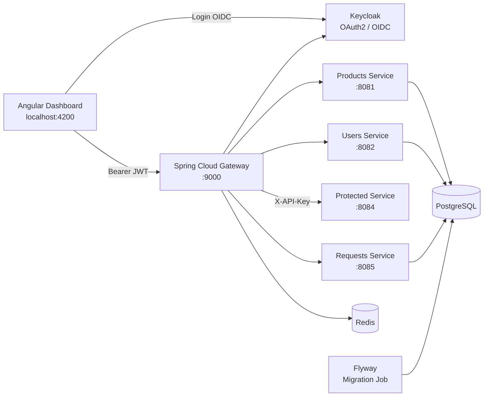
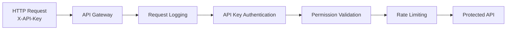
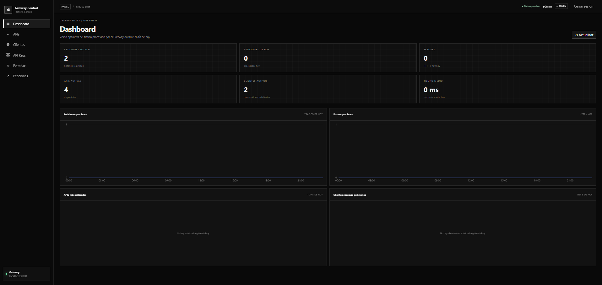
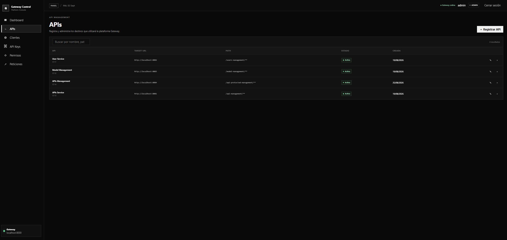
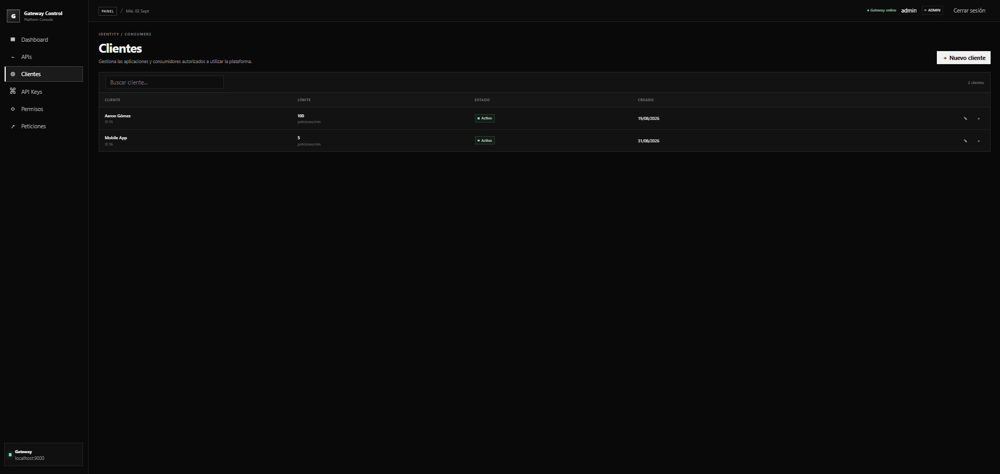
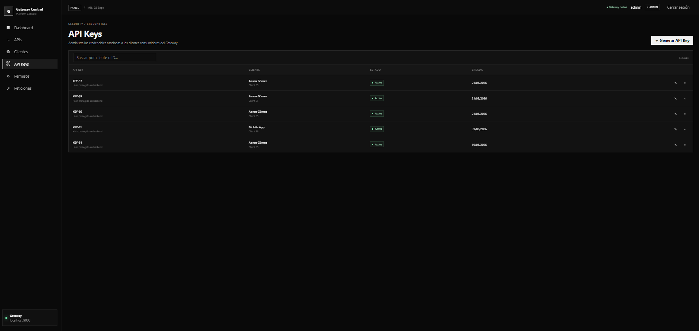
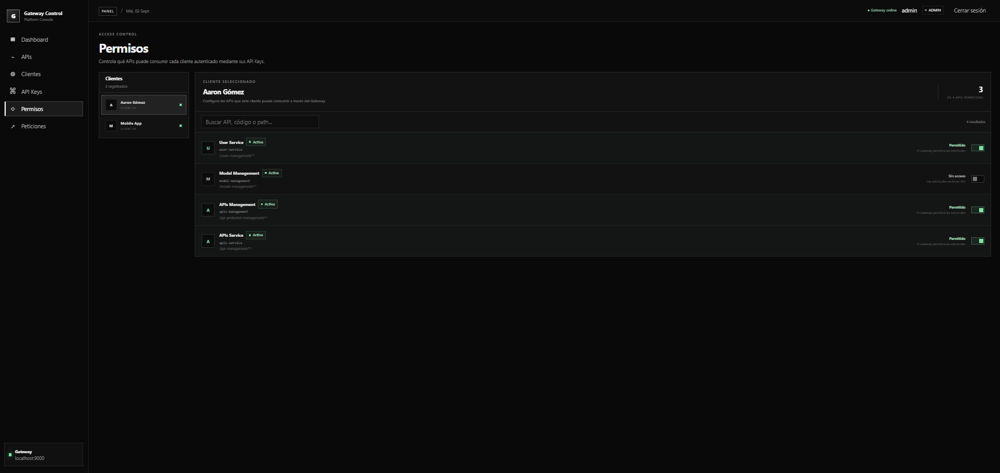
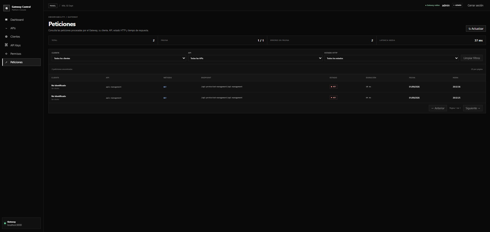

# API Gateway Platform

Plataforma full stack para gestionar, securizar y monitorizar el acceso a APIs mediante un API Gateway.

El proyecto implementa una arquitectura basada en microservicios donde el Gateway actúa como punto de entrada único y centraliza autenticación mediante API Keys, autorización por permisos, rate limiting distribuido, seguridad OAuth2/OIDC y registro de peticiones. Incluye además un dashboard Angular para administrar clientes, APIs, credenciales, permisos y métricas.

## Objetivo

El objetivo del proyecto es simular una plataforma real de gestión de APIs similar, a menor escala, a soluciones de API Management utilizadas en entornos empresariales.

Permite separar dos tipos de tráfico:

- **Management plane**: administración de APIs, clientes, API Keys, permisos y métricas mediante Angular y autenticación OAuth2/OIDC.
- **Data plane**: consumo de APIs externas mediante `X-API-Key`, autorización y rate limiting.

## Funcionalidades

### API Gateway

- Enrutamiento centralizado de peticiones.
- Filtros globales y específicos por ruta.
- Generación de Request ID.
- Logging de peticiones.
- Propagación de identidad del cliente.
- Comunicación entre microservicios.

### API Keys

- Creación y gestión de API Keys.
- La clave completa solo se muestra durante su creación.
- Persistencia del hash SHA-256 de la API Key.
- Validación centralizada desde el Gateway.
- Asociación entre API Keys y clientes.

### Permisos

- Autorización por cliente y API.
- Política `default deny`.
- Separación entre autenticación y autorización.
- Respuesta `403 Forbidden` cuando un cliente no tiene acceso a una API.

### Rate limiting

- Límites configurables por cliente.
- Contadores almacenados en Redis.
- Ventanas de tiempo compartidas entre instancias.
- Operaciones atómicas mediante Lua.
- Respuesta `429 Too Many Requests` al superar el límite.
- Headers con información del límite y tiempo de reset.

### OAuth2 / OpenID Connect

El dashboard administrativo utiliza Keycloak como Identity Provider.

Se utiliza:

- OAuth2.
- OpenID Connect.
- Authorization Code Flow.
- PKCE.
- JWT.
- Roles de usuario.
- Spring Security Resource Server.

El frontend no almacena secretos de cliente.

### Request logging

Las peticiones realizadas contra las APIs protegidas se registran de forma persistente.

Se almacena:

- Cliente.
- API.
- Endpoint.
- Método HTTP.
- Código de estado.
- Duración.
- Fecha de ejecución.

El logging se realiza de forma desacoplada para evitar que un fallo en el sistema de observabilidad afecte al tráfico principal.

### Dashboard

El dashboard muestra información agregada sobre el uso de la plataforma:

- Peticiones totales.
- Peticiones del día.
- Errores.
- Tiempo medio de respuesta.
- APIs activas.
- Clientes activos.
- Peticiones por hora.
- Errores por hora.
- APIs más utilizadas.
- Clientes con mayor uso.

Los gráficos se representan utilizando Apache ECharts.

---

## Arquitectura



### Flujo de una petición protegida



Una petición protegida pasa por las siguientes etapas:

1. El Gateway recibe la petición.
2. Se genera y propaga un identificador de petición.
3. Se valida la API Key.
4. Se identifica el cliente propietario de la clave.
5. Se comprueba si el cliente tiene permiso para consumir la API.
6. Se consulta el rate limit del cliente en Redis.
7. Si todas las validaciones son correctas, la petición llega al servicio protegido.
8. El resultado se registra en el servicio de request logging.

---

## Servicios

| Componente | Puerto | Responsabilidad |
|---|---:|---|
| Angular / Nginx | 4200 | Dashboard administrativo |
| Keycloak | 8080 | OAuth2 / OIDC e identidad |
| Products Service | 8081 | Gestión de APIs |
| Users Service | 8082 | Clientes, API Keys y permisos |
| Protected Service | 8084 | API protegida de demostración |
| Requests Service | 8085 | Logs y métricas de peticiones |
| API Gateway | 9000 | Routing, seguridad y filtros |
| PostgreSQL | 5432 | Persistencia |
| Redis | 6379 | Rate limiting distribuido |

Las migraciones de base de datos se ejecutan mediante un contenedor temporal de Flyway antes de iniciar los servicios dependientes.

---

## Tecnologías

### Backend

- Java 17
- Spring Boot 4
- Spring Cloud Gateway
- Spring WebFlux
- Spring WebClient
- Spring Security
- OAuth2 Resource Server
- Spring Data JPA
- Hibernate
- Maven

### Frontend

- Angular 21
- TypeScript
- RxJS
- Keycloak JS
- Apache ECharts
- ngx-echarts
- Nginx

### Infraestructura

- Docker
- Docker Compose
- PostgreSQL 17
- Redis 8
- Keycloak 26
- Flyway

---

## Estructura del proyecto

```text
API-Gateway-platform/
├── docker/
│   └── keycloak/
│
├── frontend/
│   └── dashboard-angular/
│
├── gateway/
│   └── api-gateway/
│       └── proxy/
│
├── services/
│   ├── management-service/
│   │   └── model/
│   ├── products-service/
│   ├── protected-service/
│   ├── requests-service/
│   └── users-service/
│
├── API-Gateway-Platform.postman_collection.json
├── docker-compose.yml
├── .env.example
└── README.md
```

---

## Cómo ejecutar el proyecto

### Requisitos

Solo es necesario tener instalados:

- Git.
- Docker.
- Docker Compose.

No es necesario instalar localmente PostgreSQL, Redis, Keycloak, Java, Maven, Node.js ni Angular CLI para ejecutar la plataforma mediante Docker.

### 1. Clonar el repositorio

```bash
git clone https://github.com/aarongmez18/API-Gateway-platform.git
cd API-Gateway-platform
```

### 2. Crear configuración local

Copiar:

```text
.env.example
```

como:

```text
.env
```

En Windows:

```cmd
copy .env.example .env
```

En Linux/macOS:

```bash
cp .env.example .env
```

Los valores pueden modificarse según el entorno local.

### 3. Arrancar la plataforma

```bash
docker compose up --build
```

Docker Compose:

1. Arranca PostgreSQL.
2. Espera hasta que la base de datos esté disponible.
3. Ejecuta las migraciones Flyway.
4. Arranca Redis.
5. Arranca Keycloak e importa automáticamente el realm.
6. Arranca los microservicios.
7. Arranca el API Gateway.
8. Construye Angular y lo sirve mediante Nginx.

### 4. Acceder

Dashboard:

```text
http://localhost:4200
```

Keycloak:

```text
http://localhost:8080
```

Gateway:

```text
http://localhost:9000
```

### Detener la plataforma

```bash
docker compose down
```

Para eliminar también los volúmenes:

```bash
docker compose down -v
```

---

## Seguridad

La plataforma utiliza dos mecanismos de autenticación distintos según el tipo de consumidor.

### Usuarios del dashboard

```text
Angular
   ↓
OAuth2 / OIDC
   ↓
Keycloak
   ↓
JWT Bearer Token
   ↓
Gateway
```

### Aplicaciones externas

```text
External Client
      ↓
X-API-Key
      ↓
Gateway
      ↓
API Key validation
      ↓
Permission validation
      ↓
Rate limiting
      ↓
Protected API
```

Esto permite separar la seguridad utilizada por usuarios humanos de la utilizada por aplicaciones consumidoras de APIs.

---

## Gestión de errores

El Gateway diferencia los principales escenarios de error:

| Código | Situación |
|---:|---|
| 401 | API Key ausente o inválida / autenticación inválida |
| 403 | Cliente sin permiso para consumir la API |
| 429 | Rate limit superado |
| 503 | Dependencia necesaria no disponible |

El sistema de request logging registra tanto peticiones correctas como errores producidos durante el procesamiento.

---

## Capturas

### Dashboard



### Gestión de APIs



### Gestión de clientes



### API Keys



### Permisos



### Request logs



---

## Postman

El repositorio incluye la colección:

```text
API-Gateway-Platform.postman_collection.json
```

Puede importarse directamente en Postman para probar los endpoints principales de la plataforma.

---

## Decisiones de diseño

### API Keys almacenadas mediante hash

Las API Keys no se almacenan en texto plano. El valor completo se entrega únicamente al crearlas y en base de datos se persiste su hash.

### Default deny en permisos

Un cliente no puede consumir una API salvo que tenga un permiso explícitamente configurado.

### Redis para rate limiting

El estado del rate limiter no se mantiene en memoria del Gateway. Redis permite compartir el contador entre distintas instancias y realizar las operaciones de forma atómica.

### Logging desacoplado

El registro de peticiones se realiza de forma independiente para evitar que una caída del servicio de observabilidad bloquee el tráfico de negocio.

### Migraciones centralizadas

El esquema de PostgreSQL se gestiona mediante Flyway y se aplica automáticamente antes de arrancar los servicios que dependen de la base de datos.

### Keycloak reproducible

El realm de desarrollo se almacena como configuración versionada e importable, evitando configuraciones manuales después de clonar el repositorio.

---

## Qué he aprendido

Este proyecto me ha permitido trabajar de forma práctica con conceptos habituales en arquitecturas backend y plataformas de integración:

- Diseño de un API Gateway.
- Arquitecturas basadas en microservicios.
- Autenticación mediante API Keys.
- OAuth2 y OpenID Connect.
- JWT y Spring Security.
- Autorización basada en permisos.
- Rate limiting distribuido.
- Redis y operaciones atómicas.
- Persistencia con PostgreSQL.
- Versionado de base de datos mediante Flyway.
- Comunicación entre servicios.
- Programación reactiva en el Gateway.
- Gestión de errores HTTP.
- Observabilidad y request logging.
- Desarrollo frontend con Angular.
- Visualización de métricas.
- Dockerización multi-stage.
- Networking interno de Docker Compose.
- Configuración reproducible de Keycloak.
- Separación entre configuración local y código versionado.

---

## Estado del proyecto

El proyecto se considera funcionalmente terminado.

El objetivo no es implementar todas las características de una solución comercial de API Management, sino construir una plataforma completa que permita estudiar y demostrar los principales conceptos de seguridad, routing, control de acceso, rate limiting, observabilidad y despliegue asociados a un API Gateway.

---

## Licencia

Este proyecto se distribuye bajo los términos definidos en el archivo [LICENSE](LICENSE).